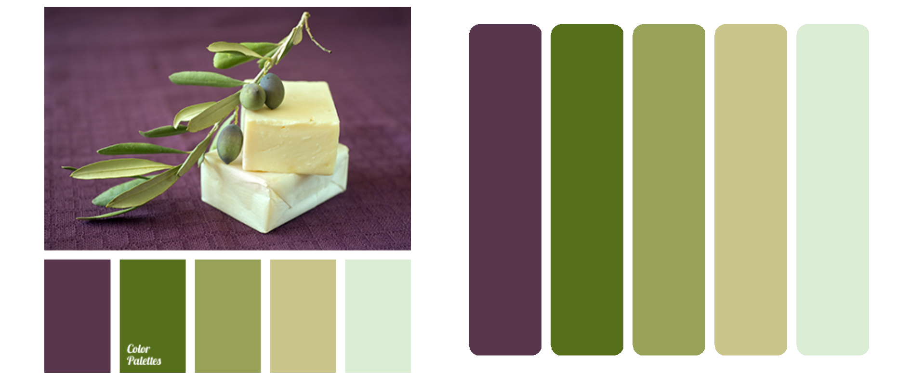

# eyedroppeR 

With `eyedroppeR` you can click on the image and it will return the hex codes of the selected pixel all within R.

There are a few ways to get colours from an image but the aim is to provide a simple, no fuss approach to get the hex codes into R.

## Installation

```{r, eval = FALSE}
devtools::install_github("doehm/eyedroppeR")
```

## Usage

Use `eyedropper` with the following steps:

1. Find the image you want to pick colours from online.
2. Right-click and 'copy image address'.

    2.a As an example copy the following link to the clipboard (right-click > copy image address).
    
    

3. Choose how many colours to pick e.g. `n = 5`.
4. Run `pal <- eyedropper(n = 5)`. 
    
    4.a. `eyedropper` will read the copied address from the clipboard.
    
    4.b. If you have a local file or a saved `path` you can reference it directly with 
    `pal <- eyedropper(n = 5, img_path = path)`
    
5. Click the 5 desired colours. The image will be stretched to the borders of the window, but that's OK.
6. Done! Copy the returned string and add it to your script and start using `pal`.

```{r, eval = FALSE}
pal <- eyedropper(n = 5)

Click on image to select colours
Colours selected: 5/5
 ------ pal ------
               

pal <- c('#57364e', '#566f1b', '#97a258', '#cac58b', '#dbedd5')
```





## Other functions

* `sort_pal`: Allows you to manually sort a palette by clicking on the colours in order. It also allows you to select a specified number of colours if you don't want them all.

* `extract_pal`: Automatically selects a specified number of colours using a clustering algorithm. It will read the image path from the clipboard as well and allow you to sort the colours after they are extracted.

* `show_pal`: Simple helper to display the palette.
