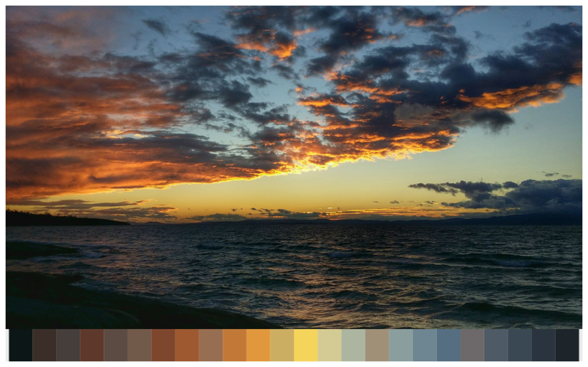
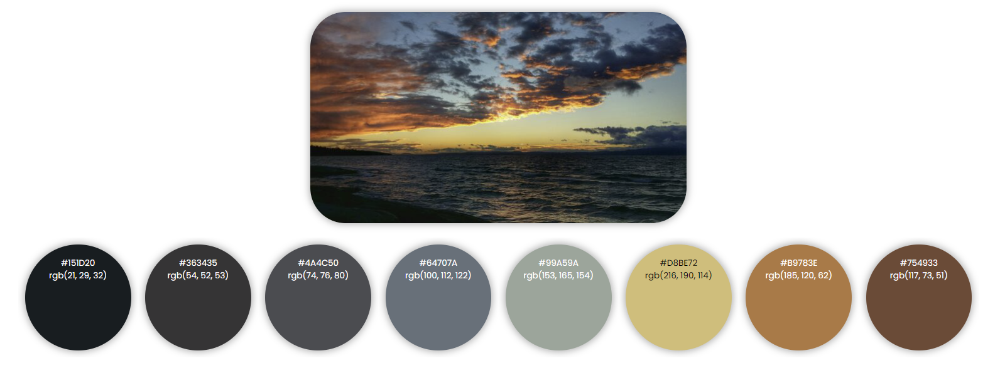
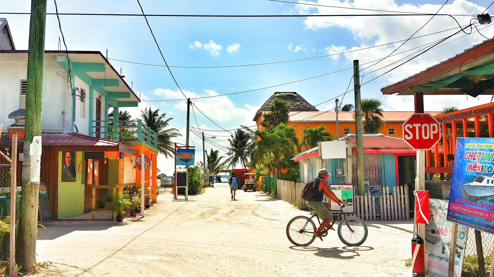
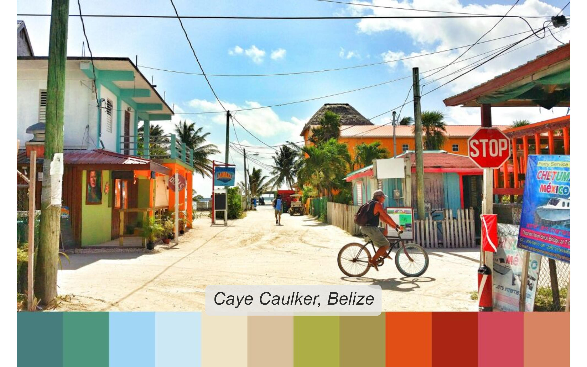
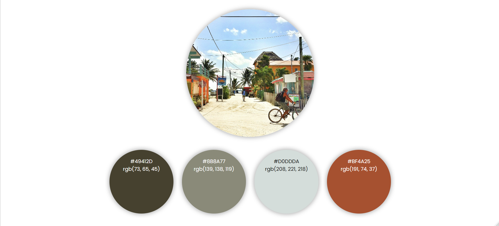

# eyedroppeR 

There are fancy ways to extract colours from images but sometimes it's easier if you could simply click on the image and choose the colours you want.

With `eyedroppeR` you can click on the image and it will return the hex codes of the selected pixel all within R.

## Installation

```{r, eval = FALSE}
devtools::install_github("doehm/eyedroppeR")
```

## Usage

Use `eyedropper` with the following steps:

1. Find the image you want to pick colours from online. Local images cn be used as well.
2. Right-click and 'copy image address'. As an example copy the following image (right-click > copy image address).
    
    

3. Choose how many colours to pick e.g. `n = 8`.
4. Run `eyedropper(n = 8, img_path = '<paste address here>', label = "Sunset on the South Coast")`. 

    

5. Click the 8 desired colours. You can click on either the image itself or the swatch at the bottom. The image will be stretched to the borders of the window, but that's OK.
6. Done! Copy the returned string and add it to your script and start using `pal`.

    

The palette, image that is saved at the temporary address, and the label will also be returned by the function. It will also output to console a message that can be copied and pasted directly to your code. That's the best part!


## Automatically extract a palette with `extract_pal`

To speed up the process and if you're not looking for specific colours you can run `extract_pal` to automatically select some for you.

```{r, eval = FALSE}

library(eyedroppeR)

path <- "https://github.com/doehm/eyedroppeR/blob/main/dev/images/belize.jpg?raw=true"
extract_pal(12, path, label = "Caye Caulker, Belize", sort = "auto")

```



```
caye_caulker_belize <- c('#477d7c', '#4f967e', '#a1d6f5', '#cbe8f4', '#f0e4c6', '#d8c09c', '#adae46', '#a6954f', '#e14f16', '#a92613', '#cf4959', '#d78462')

$label
[1] "Caye Caulker, Belize"

$pal
 [1] "#477d7c" "#4f967e" "#a1d6f5" "#cbe8f4" "#f0e4c6" "#d8c09c" "#adae46" "#a6954f" "#e14f16" "#a92613"
[11] "#cf4959" "#d78462"

$img_path
[1] "C:\\Users\\Dan\\AppData\\Local\\Temp\\RtmpIN1NcN\\file70302f63b83"
```


Often you won't quite get what you're after and you'll want to use `eyedropper` instead.

## Use `swatch()` to view a palette

```{r, echo = FALSE}
suppressPackageStartupMessages(library(eyedroppeR))
```


```{r, eval=FALSE}
path <- "https://github.com/doehm/eyedroppeR/blob/main/dev/images/belize.jpg?raw=true"
x <- extract_pal(4, path, sort = "auto")

swatch(x$pal, path)
```



## Other functions

* `sort_pal`: Allows you to manually sort a palette by clicking on the colours in order. It also allows you to select a specified number of colours if you don't want them all.

* `show_pencil_case`: There are a bunch of palettes stored in the `pencil_case`. This will plot them all so you can easily choose the one you want.

* `palette`: Helper to read a palette from the `pencil_case`. e.g. `palette(1)`

## Palettes in the `pencil_case`

```{r, eval=FALSE}
show_pencil_case()
```

<iframe >
