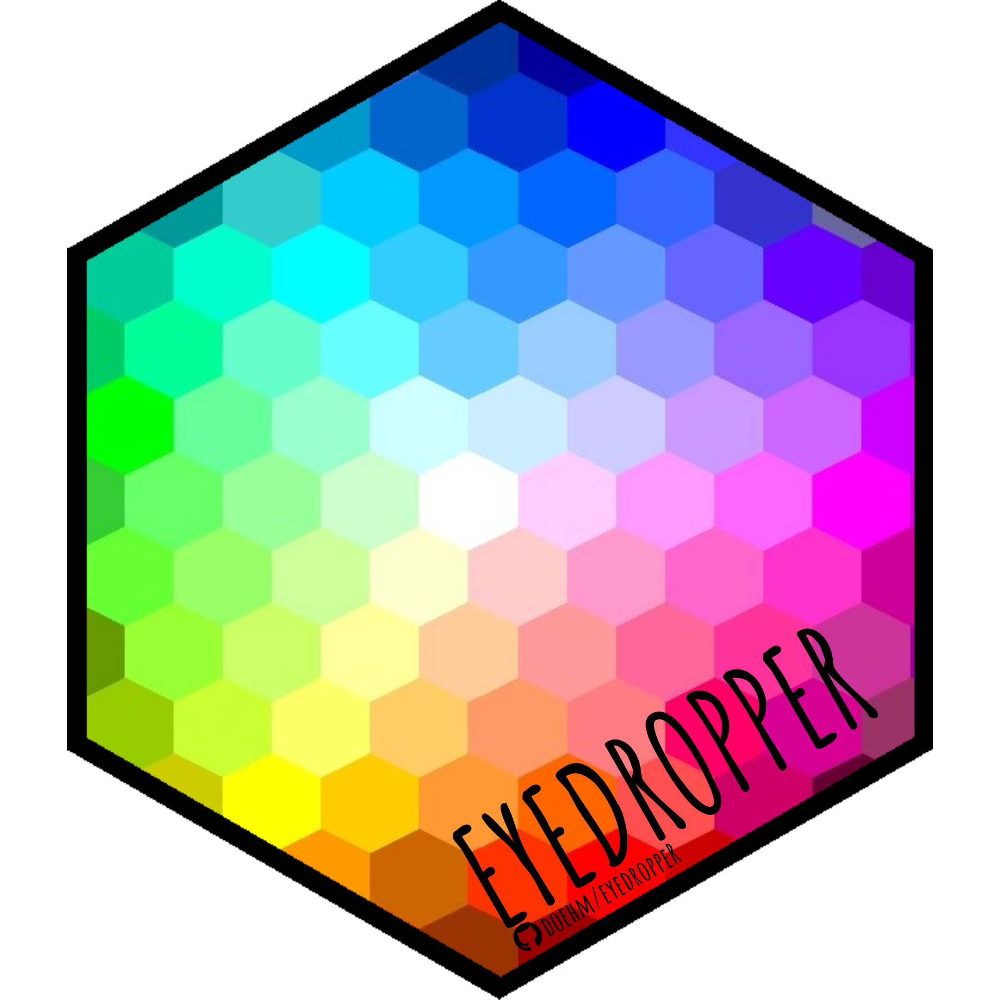
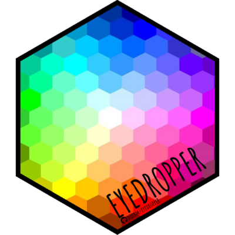
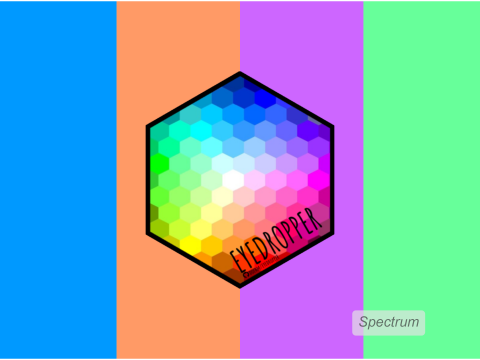
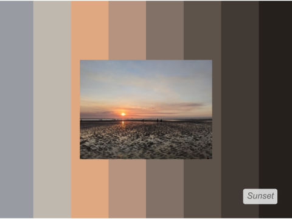

# eyedroppeR 

There are fancy ways to extract colours from images but sometimes it's easier if you could simply click on the image and choose the colours you want.

With `eyedroppeR` you can click on the image and it will return the hex codes of the selected pixel all within R.

## Installation

```{r, eval = FALSE}
devtools::install_github("doehm/eyedroppeR")
```

## Usage

Use `eyedropper` with the following steps:

1. Find the image you want to pick colours from online.
2. Right-click and 'copy image address'. As an example copy the following link to the clipboard (right-click > copy image address).
    
    <!--  -->
    

3. Choose how many colours to pick e.g. `n = 4`.
4. Run `eyedropper(n = 4, img_path = '<paste address here>', label = "Spectrum")`. 
5. Click the 4 desired colours. The image will be stretched to the borders of the window, but that's OK.
6. Done! Copy the returned string and add it to your script and start using `pal`.




<!--  -->

The palette, image that is saved at the temporary address, and the label will also be returned by the function. It will also output to conosole a message that can be copied and pasted directly to your code. That's the best part!


## Automatically extract palette with `extract_pal`


```{r, eval = FALSE}

library(eyedroppeR)

path <- file.path(system.file(package = "eyedroppeR"), "images", "sunset.png")
extract_pal(8, path, label = "Sunset", sort = "auto")

```



```
sunset <- c('#989CA2', '#BFB8AF', '#E0A880', '#B5937E', '#827167', '#5D534B', '#413933', '#25201C')

$label
[1] "Sunset"

$pal
[1] "#989CA2", "#BFB8AF" "#E0A880" "#B5937E" "#827167" "#5D534B" "#413933" "#25201C" 

$img_path
[1] "C:\\Users\\Dan\\AppData\\Local\\Temp\\Rtmp6nr45a\\file20f46ed067bf"
```

## Other functions

* `sort_pal`: Allows you to manually sort a palette by clicking on the colours in order. It also allows you to select a specified number of colours if you don't want them all.

* `show_pal`: Simple helper to display the palette.


```{css, echo = FALSE, include = FALSE}
.myimg {
  max-height: 360px;
}
```

