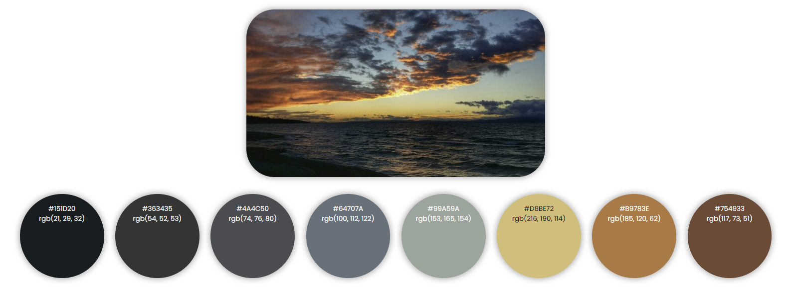
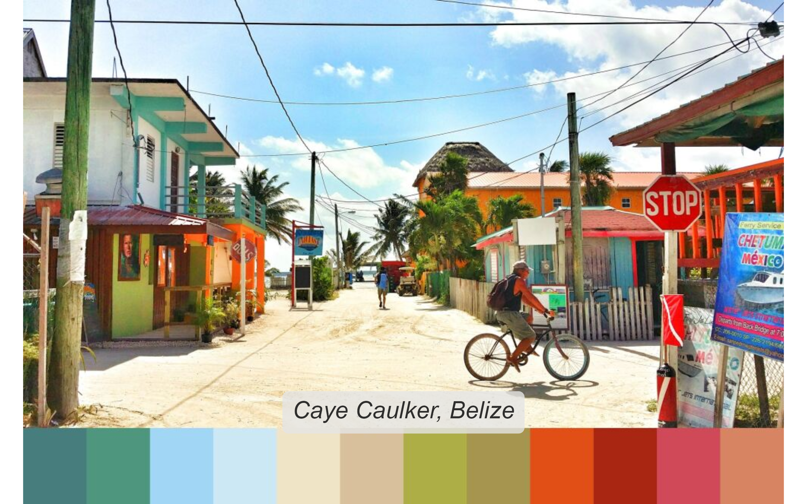

# eyedroppeR 

There are fancy ways to extract colours from images but sometimes it’s
easier if you could simply click on the image and choose the colours you
want.

With `eyedroppeR` you can click on the image and it will return the hex
codes of the selected pixel all within R.

## Installation

``` r
devtools::install_github("doehm/eyedroppeR")
```

## Usage

Use `eyedropper` with the following steps:

1.  Find the image you want to pick colours from online. Local images cn
    be used as well.

2.  Right-click and ‘copy image address’. As an example copy the
    following image (right-click \> copy image address).

    

3.  Choose how many colours to pick e.g. `n = 8`.

4.  Run
    `eyedropper(n = 8, img_path = '<paste address here>', label = "Sunset on the South Coast")`.

    

5.  Click the 8 desired colours. You can click on either the image
    itself or the swatch at the bottom. The image will be stretched to
    the borders of the window, but that’s OK.

6.  Done! Copy the returned string and add it to your script and start
    using `pal`.

    

The palette, image that is saved at the temporary address, and the label
will also be returned by the function. It will also output to console a
message that can be copied and pasted directly to your code. That’s the
best part!

## Automatically extract a palette with `extract_pal`

To speed up the process and if you’re not looking for specific colours
you can run `extract_pal` to automatically select some for you.

``` r
library(eyedroppeR)

path <- "https://github.com/doehm/eyedroppeR/blob/main/dev/images/belize.jpg?raw=true"
extract_pal(12, path, label = "Caye Caulker, Belize", sort = "auto")
```


    caye_caulker_belize <- c('#477d7c', '#4f967e', '#a1d6f5', '#cbe8f4', '#f0e4c6', '#d8c09c', '#adae46', '#a6954f', '#e14f16', '#a92613', '#cf4959', '#d78462')

    $label
    [1] "Caye Caulker, Belize"

    $pal
     [1] "#477d7c" "#4f967e" "#a1d6f5" "#cbe8f4" "#f0e4c6" "#d8c09c" "#adae46" "#a6954f" "#e14f16" "#a92613"
    [11] "#cf4959" "#d78462"

    $img_path
    [1] "C:\\Users\\Dan\\AppData\\Local\\Temp\\RtmpIN1NcN\\file70302f63b83"



Often you won’t quite get what you’re after and you’ll want to use
`eyedropper` instead.

## Use `swatch()` to view a palette

``` r
path <- "https://github.com/doehm/eyedroppeR/blob/main/dev/images/belize.jpg?raw=true"
x <- extract_pal(4, path, sort = "auto")

swatch(x$pal, path)
```


## Other functions

- `sort_pal`: Allows you to manually sort a palette by clicking on the
  colours in order. It also allows you to select a specified number of
  colours if you don’t want them all.

- `show_pencil_case`: There are a bunch of palettes stored in the
  `pencil_case`. This will plot them all so you can easily choose the
  one you want.

- `palette`: Helper to read a palette from the `pencil_case`.
  e.g. `palette(1)`

## Palettes in the `pencil_case`

``` r
show_pencil_case()
```

\`

<div id="mcblypjzpj"
style="padding-left:0px;padding-right:0px;padding-top:10px;padding-bottom:10px;overflow-x:auto;overflow-y:auto;width:auto;height:auto;">

<style>@import url("https://fonts.googleapis.com/css2?family=Lexend:ital,wght@0,100;0,200;0,300;0,400;0,500;0,600;0,700;0,800;0,900;1,100;1,200;1,300;1,400;1,500;1,600;1,700;1,800;1,900&display=swap");
#mcblypjzpj table {
  font-family: system-ui, 'Segoe UI', Roboto, Helvetica, Arial, sans-serif, 'Apple Color Emoji', 'Segoe UI Emoji', 'Segoe UI Symbol', 'Noto Color Emoji';
  -webkit-font-smoothing: antialiased;
  -moz-osx-font-smoothing: grayscale;
}
&#10;#mcblypjzpj thead, #mcblypjzpj tbody, #mcblypjzpj tfoot, #mcblypjzpj tr, #mcblypjzpj td, #mcblypjzpj th {
  border-style: none;
}
&#10;#mcblypjzpj p {
  margin: 0;
  padding: 0;
}
&#10;#mcblypjzpj .gt_table {
  display: table;
  border-collapse: collapse;
  line-height: normal;
  margin-left: auto;
  margin-right: auto;
  color: #333333;
  font-size: 16px;
  font-weight: normal;
  font-style: normal;
  background-color: #FFFFFF;
  width: auto;
  border-top-style: solid;
  border-top-width: 0px;
  border-top-color: #A8A8A8;
  border-right-style: none;
  border-right-width: 2px;
  border-right-color: #D3D3D3;
  border-bottom-style: solid;
  border-bottom-width: 0px;
  border-bottom-color: #A8A8A8;
  border-left-style: none;
  border-left-width: 2px;
  border-left-color: #D3D3D3;
}
&#10;#mcblypjzpj .gt_caption {
  padding-top: 4px;
  padding-bottom: 4px;
}
&#10;#mcblypjzpj .gt_title {
  color: #333333;
  font-size: 125%;
  font-weight: initial;
  padding-top: 4px;
  padding-bottom: 4px;
  padding-left: 5px;
  padding-right: 5px;
  border-bottom-color: #FFFFFF;
  border-bottom-width: 0;
}
&#10;#mcblypjzpj .gt_subtitle {
  color: #333333;
  font-size: 85%;
  font-weight: initial;
  padding-top: 3px;
  padding-bottom: 5px;
  padding-left: 5px;
  padding-right: 5px;
  border-top-color: #FFFFFF;
  border-top-width: 0;
}
&#10;#mcblypjzpj .gt_heading {
  background-color: #FFFFFF;
  text-align: center;
  border-bottom-color: #FFFFFF;
  border-left-style: none;
  border-left-width: 1px;
  border-left-color: #D3D3D3;
  border-right-style: none;
  border-right-width: 1px;
  border-right-color: #D3D3D3;
}
&#10;#mcblypjzpj .gt_bottom_border {
  border-bottom-style: solid;
  border-bottom-width: 0px;
  border-bottom-color: #D3D3D3;
}
&#10;#mcblypjzpj .gt_col_headings {
  border-top-style: solid;
  border-top-width: 0px;
  border-top-color: #D3D3D3;
  border-bottom-style: solid;
  border-bottom-width: 0px;
  border-bottom-color: #D3D3D3;
  border-left-style: none;
  border-left-width: 1px;
  border-left-color: #D3D3D3;
  border-right-style: none;
  border-right-width: 1px;
  border-right-color: #D3D3D3;
}
&#10;#mcblypjzpj .gt_col_heading {
  color: #333333;
  background-color: #FFFFFF;
  font-size: 0px;
  font-weight: normal;
  text-transform: inherit;
  border-left-style: none;
  border-left-width: 1px;
  border-left-color: #D3D3D3;
  border-right-style: none;
  border-right-width: 1px;
  border-right-color: #D3D3D3;
  vertical-align: bottom;
  padding-top: 5px;
  padding-bottom: 6px;
  padding-left: 5px;
  padding-right: 5px;
  overflow-x: hidden;
}
&#10;#mcblypjzpj .gt_column_spanner_outer {
  color: #333333;
  background-color: #FFFFFF;
  font-size: 0px;
  font-weight: normal;
  text-transform: inherit;
  padding-top: 0;
  padding-bottom: 0;
  padding-left: 4px;
  padding-right: 4px;
}
&#10;#mcblypjzpj .gt_column_spanner_outer:first-child {
  padding-left: 0;
}
&#10;#mcblypjzpj .gt_column_spanner_outer:last-child {
  padding-right: 0;
}
&#10;#mcblypjzpj .gt_column_spanner {
  border-bottom-style: solid;
  border-bottom-width: 0px;
  border-bottom-color: #D3D3D3;
  vertical-align: bottom;
  padding-top: 5px;
  padding-bottom: 5px;
  overflow-x: hidden;
  display: inline-block;
  width: 100%;
}
&#10;#mcblypjzpj .gt_spanner_row {
  border-bottom-style: hidden;
}
&#10;#mcblypjzpj .gt_group_heading {
  padding-top: 8px;
  padding-bottom: 8px;
  padding-left: 5px;
  padding-right: 5px;
  color: #333333;
  background-color: #FFFFFF;
  font-size: 100%;
  font-weight: initial;
  text-transform: inherit;
  border-top-style: solid;
  border-top-width: 2px;
  border-top-color: #D3D3D3;
  border-bottom-style: solid;
  border-bottom-width: 2px;
  border-bottom-color: #D3D3D3;
  border-left-style: none;
  border-left-width: 1px;
  border-left-color: #D3D3D3;
  border-right-style: none;
  border-right-width: 1px;
  border-right-color: #D3D3D3;
  vertical-align: middle;
  text-align: left;
}
&#10;#mcblypjzpj .gt_empty_group_heading {
  padding: 0.5px;
  color: #333333;
  background-color: #FFFFFF;
  font-size: 100%;
  font-weight: initial;
  border-top-style: solid;
  border-top-width: 2px;
  border-top-color: #D3D3D3;
  border-bottom-style: solid;
  border-bottom-width: 2px;
  border-bottom-color: #D3D3D3;
  vertical-align: middle;
}
&#10;#mcblypjzpj .gt_from_md > :first-child {
  margin-top: 0;
}
&#10;#mcblypjzpj .gt_from_md > :last-child {
  margin-bottom: 0;
}
&#10;#mcblypjzpj .gt_row {
  padding-top: 10px;
  padding-bottom: 10px;
  padding-left: 10px;
  padding-right: 10px;
  margin: 10px;
  border-top-style: solid;
  border-top-width: 0px;
  border-top-color: #D3D3D3;
  border-left-style: none;
  border-left-width: 1px;
  border-left-color: #D3D3D3;
  border-right-style: none;
  border-right-width: 1px;
  border-right-color: #D3D3D3;
  vertical-align: middle;
  overflow-x: hidden;
}
&#10;#mcblypjzpj .gt_stub {
  color: #333333;
  background-color: #FFFFFF;
  font-size: 100%;
  font-weight: initial;
  text-transform: inherit;
  border-right-style: solid;
  border-right-width: 2px;
  border-right-color: #D3D3D3;
  padding-left: 10px;
  padding-right: 10px;
}
&#10;#mcblypjzpj .gt_stub_row_group {
  color: #333333;
  background-color: #FFFFFF;
  font-size: 100%;
  font-weight: initial;
  text-transform: inherit;
  border-right-style: solid;
  border-right-width: 2px;
  border-right-color: #D3D3D3;
  padding-left: 5px;
  padding-right: 5px;
  vertical-align: top;
}
&#10;#mcblypjzpj .gt_row_group_first td {
  border-top-width: 2px;
}
&#10;#mcblypjzpj .gt_row_group_first th {
  border-top-width: 2px;
}
&#10;#mcblypjzpj .gt_summary_row {
  color: #333333;
  background-color: #FFFFFF;
  text-transform: inherit;
  padding-top: 8px;
  padding-bottom: 8px;
  padding-left: 5px;
  padding-right: 5px;
}
&#10;#mcblypjzpj .gt_first_summary_row {
  border-top-style: solid;
  border-top-color: #D3D3D3;
}
&#10;#mcblypjzpj .gt_first_summary_row.thick {
  border-top-width: 2px;
}
&#10;#mcblypjzpj .gt_last_summary_row {
  padding-top: 8px;
  padding-bottom: 8px;
  padding-left: 5px;
  padding-right: 5px;
  border-bottom-style: solid;
  border-bottom-width: 2px;
  border-bottom-color: #D3D3D3;
}
&#10;#mcblypjzpj .gt_grand_summary_row {
  color: #333333;
  background-color: #FFFFFF;
  text-transform: inherit;
  padding-top: 8px;
  padding-bottom: 8px;
  padding-left: 5px;
  padding-right: 5px;
}
&#10;#mcblypjzpj .gt_first_grand_summary_row {
  padding-top: 8px;
  padding-bottom: 8px;
  padding-left: 5px;
  padding-right: 5px;
  border-top-style: double;
  border-top-width: 6px;
  border-top-color: #D3D3D3;
}
&#10;#mcblypjzpj .gt_last_grand_summary_row_top {
  padding-top: 8px;
  padding-bottom: 8px;
  padding-left: 5px;
  padding-right: 5px;
  border-bottom-style: double;
  border-bottom-width: 6px;
  border-bottom-color: #D3D3D3;
}
&#10;#mcblypjzpj .gt_striped {
  background-color: rgba(128, 128, 128, 0.05);
}
&#10;#mcblypjzpj .gt_table_body {
  border-top-style: solid;
  border-top-width: 0px;
  border-top-color: #D3D3D3;
  border-bottom-style: solid;
  border-bottom-width: 0px;
  border-bottom-color: #D3D3D3;
}
&#10;#mcblypjzpj .gt_footnotes {
  color: #333333;
  background-color: #FFFFFF;
  border-bottom-style: none;
  border-bottom-width: 2px;
  border-bottom-color: #D3D3D3;
  border-left-style: none;
  border-left-width: 2px;
  border-left-color: #D3D3D3;
  border-right-style: none;
  border-right-width: 2px;
  border-right-color: #D3D3D3;
}
&#10;#mcblypjzpj .gt_footnote {
  margin: 0px;
  font-size: 90%;
  padding-top: 4px;
  padding-bottom: 4px;
  padding-left: 5px;
  padding-right: 5px;
}
&#10;#mcblypjzpj .gt_sourcenotes {
  color: #333333;
  background-color: #FFFFFF;
  border-bottom-style: none;
  border-bottom-width: 2px;
  border-bottom-color: #D3D3D3;
  border-left-style: none;
  border-left-width: 2px;
  border-left-color: #D3D3D3;
  border-right-style: none;
  border-right-width: 2px;
  border-right-color: #D3D3D3;
}
&#10;#mcblypjzpj .gt_sourcenote {
  font-size: 90%;
  padding-top: 4px;
  padding-bottom: 4px;
  padding-left: 5px;
  padding-right: 5px;
}
&#10;#mcblypjzpj .gt_left {
  text-align: left;
}
&#10;#mcblypjzpj .gt_center {
  text-align: center;
}
&#10;#mcblypjzpj .gt_right {
  text-align: right;
  font-variant-numeric: tabular-nums;
}
&#10;#mcblypjzpj .gt_font_normal {
  font-weight: normal;
}
&#10;#mcblypjzpj .gt_font_bold {
  font-weight: bold;
}
&#10;#mcblypjzpj .gt_font_italic {
  font-style: italic;
}
&#10;#mcblypjzpj .gt_super {
  font-size: 65%;
}
&#10;#mcblypjzpj .gt_footnote_marks {
  font-size: 75%;
  vertical-align: 0.4em;
  position: initial;
}
&#10;#mcblypjzpj .gt_asterisk {
  font-size: 100%;
  vertical-align: 0;
}
&#10;#mcblypjzpj .gt_indent_1 {
  text-indent: 5px;
}
&#10;#mcblypjzpj .gt_indent_2 {
  text-indent: 10px;
}
&#10;#mcblypjzpj .gt_indent_3 {
  text-indent: 15px;
}
&#10;#mcblypjzpj .gt_indent_4 {
  text-indent: 20px;
}
&#10;#mcblypjzpj .gt_indent_5 {
  text-indent: 25px;
}
</style>
<table class="gt_table" style="table-layout: fixed;" data-quarto-disable-processing="false" data-quarto-bootstrap="false">
<colgroup>
<col/>
<col/>
<col style="width:700px;"/>
</colgroup>
<thead>
<tr class="gt_col_headings">
<th class="gt_col_heading gt_columns_bottom_border gt_right" rowspan="1" colspan="1" scope="col" id="id">
id
</th>
<th class="gt_col_heading gt_columns_bottom_border gt_left" rowspan="1" colspan="1" scope="col" id="name">
name
</th>
<th class="gt_col_heading gt_columns_bottom_border gt_left" rowspan="1" colspan="1" scope="col" id="bg">
bg
</th>
</tr>
</thead>
<tbody class="gt_table_body">
<tr>
<td headers="id" class="gt_row gt_right" style="font-family: Lexend, system-ui, &#39;Segoe UI&#39;, Roboto, Helvetica, Arial, sans-serif, &#39;Apple Color Emoji&#39;, &#39;Segoe UI Emoji&#39;, &#39;Segoe UI Symbol&#39;, &#39;Noto Color Emoji&#39;; font-size: 24px; text-align: right;">
1
</td>
<td headers="name" class="gt_row gt_left" style="font-family: Lexend, system-ui, &#39;Segoe UI&#39;, Roboto, Helvetica, Arial, sans-serif, &#39;Apple Color Emoji&#39;, &#39;Segoe UI Emoji&#39;, &#39;Segoe UI Symbol&#39;, &#39;Noto Color Emoji&#39;; font-size: 24px; text-align: right;">
Secret of Mana
</td>
<td headers="bg" class="gt_row gt_left">
<left><span style="background-color: #E92E2C;
width: 100px;
height: 100px;
display: inline-block;
border-radius: 50%;
box-shadow: 50px 0 0 -1px #F1E32F, 100px 0 0 -1px #91A14A, 150px 0 0 -1px #373321;"></span></left>
</td>
</tr>
<tr>
<td headers="id" class="gt_row gt_right" style="font-family: Lexend, system-ui, &#39;Segoe UI&#39;, Roboto, Helvetica, Arial, sans-serif, &#39;Apple Color Emoji&#39;, &#39;Segoe UI Emoji&#39;, &#39;Segoe UI Symbol&#39;, &#39;Noto Color Emoji&#39;; font-size: 24px; text-align: right;">
2
</td>
<td headers="name" class="gt_row gt_left" style="font-family: Lexend, system-ui, &#39;Segoe UI&#39;, Roboto, Helvetica, Arial, sans-serif, &#39;Apple Color Emoji&#39;, &#39;Segoe UI Emoji&#39;, &#39;Segoe UI Symbol&#39;, &#39;Noto Color Emoji&#39;; font-size: 24px; text-align: right;">
Super Mario World
</td>
<td headers="bg" class="gt_row gt_left">
<left><span style="background-color: #37e605;
width: 100px;
height: 100px;
display: inline-block;
border-radius: 50%;
box-shadow: 50px 0 0 -1px #0d6cfd, 100px 0 0 -1px #fdfc05, 150px 0 0 -1px #fe0000;"></span></left>
</td>
</tr>
<tr>
<td headers="id" class="gt_row gt_right" style="font-family: Lexend, system-ui, &#39;Segoe UI&#39;, Roboto, Helvetica, Arial, sans-serif, &#39;Apple Color Emoji&#39;, &#39;Segoe UI Emoji&#39;, &#39;Segoe UI Symbol&#39;, &#39;Noto Color Emoji&#39;; font-size: 24px; text-align: right;">
3
</td>
<td headers="name" class="gt_row gt_left" style="font-family: Lexend, system-ui, &#39;Segoe UI&#39;, Roboto, Helvetica, Arial, sans-serif, &#39;Apple Color Emoji&#39;, &#39;Segoe UI Emoji&#39;, &#39;Segoe UI Symbol&#39;, &#39;Noto Color Emoji&#39;; font-size: 24px; text-align: right;">
Super Ghouls and Ghosts
</td>
<td headers="bg" class="gt_row gt_left">
<left><span style="background-color: #CF2023;
width: 100px;
height: 100px;
display: inline-block;
border-radius: 50%;
box-shadow: 50px 0 0 -1px #EF7434, 100px 0 0 -1px #89883D, 150px 0 0 -1px #6C6E85;"></span></left>
</td>
</tr>
<tr>
<td headers="id" class="gt_row gt_right" style="font-family: Lexend, system-ui, &#39;Segoe UI&#39;, Roboto, Helvetica, Arial, sans-serif, &#39;Apple Color Emoji&#39;, &#39;Segoe UI Emoji&#39;, &#39;Segoe UI Symbol&#39;, &#39;Noto Color Emoji&#39;; font-size: 24px; text-align: right;">
4
</td>
<td headers="name" class="gt_row gt_left" style="font-family: Lexend, system-ui, &#39;Segoe UI&#39;, Roboto, Helvetica, Arial, sans-serif, &#39;Apple Color Emoji&#39;, &#39;Segoe UI Emoji&#39;, &#39;Segoe UI Symbol&#39;, &#39;Noto Color Emoji&#39;; font-size: 24px; text-align: right;">
Super Probotector
</td>
<td headers="bg" class="gt_row gt_left">
<left><span style="background-color: #373140;
width: 100px;
height: 100px;
display: inline-block;
border-radius: 50%;
box-shadow: 50px 0 0 -1px #79484D, 100px 0 0 -1px #CB4C45, 150px 0 0 -1px #E09D5C, 200px 0 0 -1px #E1D4C8, 250px 0 0 -1px #9C99A9, 300px 0 0 -1px #536E9A, 350px 0 0 -1px #134B8A;"></span></left>
</td>
</tr>
<tr>
<td headers="id" class="gt_row gt_right" style="font-family: Lexend, system-ui, &#39;Segoe UI&#39;, Roboto, Helvetica, Arial, sans-serif, &#39;Apple Color Emoji&#39;, &#39;Segoe UI Emoji&#39;, &#39;Segoe UI Symbol&#39;, &#39;Noto Color Emoji&#39;; font-size: 24px; text-align: right;">
5
</td>
<td headers="name" class="gt_row gt_left" style="font-family: Lexend, system-ui, &#39;Segoe UI&#39;, Roboto, Helvetica, Arial, sans-serif, &#39;Apple Color Emoji&#39;, &#39;Segoe UI Emoji&#39;, &#39;Segoe UI Symbol&#39;, &#39;Noto Color Emoji&#39;; font-size: 24px; text-align: right;">
Paw Patrol
</td>
<td headers="bg" class="gt_row gt_left">
<left><span style="background-color: #11c1b9;
width: 100px;
height: 100px;
display: inline-block;
border-radius: 50%;
box-shadow: 50px 0 0 -1px #fde55d, 100px 0 0 -1px #f13837, 150px 0 0 -1px #2f406e, 200px 0 0 -1px #f37c3e, 250px 0 0 -1px #6fb455, 300px 0 0 -1px #b4485e;"></span></left>
</td>
</tr>
<tr>
<td headers="id" class="gt_row gt_right" style="font-family: Lexend, system-ui, &#39;Segoe UI&#39;, Roboto, Helvetica, Arial, sans-serif, &#39;Apple Color Emoji&#39;, &#39;Segoe UI Emoji&#39;, &#39;Segoe UI Symbol&#39;, &#39;Noto Color Emoji&#39;; font-size: 24px; text-align: right;">
6
</td>
<td headers="name" class="gt_row gt_left" style="font-family: Lexend, system-ui, &#39;Segoe UI&#39;, Roboto, Helvetica, Arial, sans-serif, &#39;Apple Color Emoji&#39;, &#39;Segoe UI Emoji&#39;, &#39;Segoe UI Symbol&#39;, &#39;Noto Color Emoji&#39;; font-size: 24px; text-align: right;">
Skittles
</td>
<td headers="bg" class="gt_row gt_left">
<left><span style="background-color: #05beed;
width: 100px;
height: 100px;
display: inline-block;
border-radius: 50%;
box-shadow: 50px 0 0 -1px #10df0b, 100px 0 0 -1px #fdf405, 150px 0 0 -1px #f67a19, 200px 0 0 -1px #f11941;"></span></left>
</td>
</tr>
<tr>
<td headers="id" class="gt_row gt_right" style="font-family: Lexend, system-ui, &#39;Segoe UI&#39;, Roboto, Helvetica, Arial, sans-serif, &#39;Apple Color Emoji&#39;, &#39;Segoe UI Emoji&#39;, &#39;Segoe UI Symbol&#39;, &#39;Noto Color Emoji&#39;; font-size: 24px; text-align: right;">
7
</td>
<td headers="name" class="gt_row gt_left" style="font-family: Lexend, system-ui, &#39;Segoe UI&#39;, Roboto, Helvetica, Arial, sans-serif, &#39;Apple Color Emoji&#39;, &#39;Segoe UI Emoji&#39;, &#39;Segoe UI Symbol&#39;, &#39;Noto Color Emoji&#39;; font-size: 24px; text-align: right;">
Bright
</td>
<td headers="bg" class="gt_row gt_left">
<left><span style="background-color: #540d6e;
width: 100px;
height: 100px;
display: inline-block;
border-radius: 50%;
box-shadow: 50px 0 0 -1px #ee4266, 100px 0 0 -1px #ffd23f, 150px 0 0 -1px #3bceac;"></span></left>
</td>
</tr>
<tr>
<td headers="id" class="gt_row gt_right" style="font-family: Lexend, system-ui, &#39;Segoe UI&#39;, Roboto, Helvetica, Arial, sans-serif, &#39;Apple Color Emoji&#39;, &#39;Segoe UI Emoji&#39;, &#39;Segoe UI Symbol&#39;, &#39;Noto Color Emoji&#39;; font-size: 24px; text-align: right;">
8
</td>
<td headers="name" class="gt_row gt_left" style="font-family: Lexend, system-ui, &#39;Segoe UI&#39;, Roboto, Helvetica, Arial, sans-serif, &#39;Apple Color Emoji&#39;, &#39;Segoe UI Emoji&#39;, &#39;Segoe UI Symbol&#39;, &#39;Noto Color Emoji&#39;; font-size: 24px; text-align: right;">
Blue Pink
</td>
<td headers="bg" class="gt_row gt_left">
<left><span style="background-color: #587DB3;
width: 100px;
height: 100px;
display: inline-block;
border-radius: 50%;
box-shadow: 50px 0 0 -1px #42BFDD, 100px 0 0 -1px #BBE6E4, 150px 0 0 -1px #F0F6F6, 200px 0 0 -1px #FF66B3;"></span></left>
</td>
</tr>
<tr>
<td headers="id" class="gt_row gt_right" style="font-family: Lexend, system-ui, &#39;Segoe UI&#39;, Roboto, Helvetica, Arial, sans-serif, &#39;Apple Color Emoji&#39;, &#39;Segoe UI Emoji&#39;, &#39;Segoe UI Symbol&#39;, &#39;Noto Color Emoji&#39;; font-size: 24px; text-align: right;">
9
</td>
<td headers="name" class="gt_row gt_left" style="font-family: Lexend, system-ui, &#39;Segoe UI&#39;, Roboto, Helvetica, Arial, sans-serif, &#39;Apple Color Emoji&#39;, &#39;Segoe UI Emoji&#39;, &#39;Segoe UI Symbol&#39;, &#39;Noto Color Emoji&#39;; font-size: 24px; text-align: right;">
Blue Orange
</td>
<td headers="bg" class="gt_row gt_left">
<left><span style="background-color: #244157;
width: 100px;
height: 100px;
display: inline-block;
border-radius: 50%;
box-shadow: 50px 0 0 -1px #219ebc, 100px 0 0 -1px #88B2C7, 150px 0 0 -1px #ffb703, 200px 0 0 -1px #fb8500, 250px 0 0 -1px #AD5A00;"></span></left>
</td>
</tr>
<tr>
<td headers="id" class="gt_row gt_right" style="font-family: Lexend, system-ui, &#39;Segoe UI&#39;, Roboto, Helvetica, Arial, sans-serif, &#39;Apple Color Emoji&#39;, &#39;Segoe UI Emoji&#39;, &#39;Segoe UI Symbol&#39;, &#39;Noto Color Emoji&#39;; font-size: 24px; text-align: right;">
10
</td>
<td headers="name" class="gt_row gt_left" style="font-family: Lexend, system-ui, &#39;Segoe UI&#39;, Roboto, Helvetica, Arial, sans-serif, &#39;Apple Color Emoji&#39;, &#39;Segoe UI Emoji&#39;, &#39;Segoe UI Symbol&#39;, &#39;Noto Color Emoji&#39;; font-size: 24px; text-align: right;">
Prgr
</td>
<td headers="bg" class="gt_row gt_left">
<left><span style="background-color: #231942;
width: 100px;
height: 100px;
display: inline-block;
border-radius: 50%;
box-shadow: 50px 0 0 -1px #3D3364, 100px 0 0 -1px #584E87, 150px 0 0 -1px #7566A0, 200px 0 0 -1px #937CB6, 250px 0 0 -1px #AAA1BC, 300px 0 0 -1px #BDD0B7, 350px 0 0 -1px #BFE7B2, 400px 0 0 -1px #A6DCAE, 450px 0 0 -1px #8ACFAB, 500px 0 0 -1px #5FBFAB, 550px 0 0 -1px #35B0AB;"></span></left>
</td>
</tr>
<tr>
<td headers="id" class="gt_row gt_right" style="font-family: Lexend, system-ui, &#39;Segoe UI&#39;, Roboto, Helvetica, Arial, sans-serif, &#39;Apple Color Emoji&#39;, &#39;Segoe UI Emoji&#39;, &#39;Segoe UI Symbol&#39;, &#39;Noto Color Emoji&#39;; font-size: 24px; text-align: right;">
11
</td>
<td headers="name" class="gt_row gt_left" style="font-family: Lexend, system-ui, &#39;Segoe UI&#39;, Roboto, Helvetica, Arial, sans-serif, &#39;Apple Color Emoji&#39;, &#39;Segoe UI Emoji&#39;, &#39;Segoe UI Symbol&#39;, &#39;Noto Color Emoji&#39;; font-size: 24px; text-align: right;">
Lakes
</td>
<td headers="bg" class="gt_row gt_left">
<left><span style="background-color: #788FCE;
width: 100px;
height: 100px;
display: inline-block;
border-radius: 50%;
box-shadow: 50px 0 0 -1px #e07a5f, 100px 0 0 -1px #f2cc8f, 150px 0 0 -1px #81b29a, 200px 0 0 -1px #f4f1de;"></span></left>
</td>
</tr>
<tr>
<td headers="id" class="gt_row gt_right" style="font-family: Lexend, system-ui, &#39;Segoe UI&#39;, Roboto, Helvetica, Arial, sans-serif, &#39;Apple Color Emoji&#39;, &#39;Segoe UI Emoji&#39;, &#39;Segoe UI Symbol&#39;, &#39;Noto Color Emoji&#39;; font-size: 24px; text-align: right;">
12
</td>
<td headers="name" class="gt_row gt_left" style="font-family: Lexend, system-ui, &#39;Segoe UI&#39;, Roboto, Helvetica, Arial, sans-serif, &#39;Apple Color Emoji&#39;, &#39;Segoe UI Emoji&#39;, &#39;Segoe UI Symbol&#39;, &#39;Noto Color Emoji&#39;; font-size: 24px; text-align: right;">
Spec
</td>
<td headers="bg" class="gt_row gt_left">
<left><span style="background-color: #005f73;
width: 100px;
height: 100px;
display: inline-block;
border-radius: 50%;
box-shadow: 50px 0 0 -1px #0a9396, 100px 0 0 -1px #94d2bd, 150px 0 0 -1px #e9d8a6, 200px 0 0 -1px #ee9b00, 250px 0 0 -1px #ca6702, 300px 0 0 -1px #bb3e03, 350px 0 0 -1px #ae2012, 400px 0 0 -1px #9b2226;"></span></left>
</td>
</tr>
<tr>
<td headers="id" class="gt_row gt_right" style="font-family: Lexend, system-ui, &#39;Segoe UI&#39;, Roboto, Helvetica, Arial, sans-serif, &#39;Apple Color Emoji&#39;, &#39;Segoe UI Emoji&#39;, &#39;Segoe UI Symbol&#39;, &#39;Noto Color Emoji&#39;; font-size: 24px; text-align: right;">
13
</td>
<td headers="name" class="gt_row gt_left" style="font-family: Lexend, system-ui, &#39;Segoe UI&#39;, Roboto, Helvetica, Arial, sans-serif, &#39;Apple Color Emoji&#39;, &#39;Segoe UI Emoji&#39;, &#39;Segoe UI Symbol&#39;, &#39;Noto Color Emoji&#39;; font-size: 24px; text-align: right;">
D 5
</td>
<td headers="bg" class="gt_row gt_left">
<left><span style="background-color: #ef476f;
width: 100px;
height: 100px;
display: inline-block;
border-radius: 50%;
box-shadow: 50px 0 0 -1px #ffd166, 100px 0 0 -1px #06d6a0, 150px 0 0 -1px #118ab2, 200px 0 0 -1px #073b4c;"></span></left>
</td>
</tr>
<tr>
<td headers="id" class="gt_row gt_right" style="font-family: Lexend, system-ui, &#39;Segoe UI&#39;, Roboto, Helvetica, Arial, sans-serif, &#39;Apple Color Emoji&#39;, &#39;Segoe UI Emoji&#39;, &#39;Segoe UI Symbol&#39;, &#39;Noto Color Emoji&#39;; font-size: 24px; text-align: right;">
14
</td>
<td headers="name" class="gt_row gt_left" style="font-family: Lexend, system-ui, &#39;Segoe UI&#39;, Roboto, Helvetica, Arial, sans-serif, &#39;Apple Color Emoji&#39;, &#39;Segoe UI Emoji&#39;, &#39;Segoe UI Symbol&#39;, &#39;Noto Color Emoji&#39;; font-size: 24px; text-align: right;">
D 10
</td>
<td headers="bg" class="gt_row gt_left">
<left><span style="background-color: #788FCE;
width: 100px;
height: 100px;
display: inline-block;
border-radius: 50%;
box-shadow: 50px 0 0 -1px #BD8184, 100px 0 0 -1px #E6956F, 150px 0 0 -1px #F2CC8F, 200px 0 0 -1px #A6BA96, 250px 0 0 -1px #C5E8E3, 300px 0 0 -1px #F4F1DE, 350px 0 0 -1px #CDC3D4, 400px 0 0 -1px #A88AD2, 450px 0 0 -1px #60627C;"></span></left>
</td>
</tr>
<tr>
<td headers="id" class="gt_row gt_right" style="font-family: Lexend, system-ui, &#39;Segoe UI&#39;, Roboto, Helvetica, Arial, sans-serif, &#39;Apple Color Emoji&#39;, &#39;Segoe UI Emoji&#39;, &#39;Segoe UI Symbol&#39;, &#39;Noto Color Emoji&#39;; font-size: 24px; text-align: right;">
15
</td>
<td headers="name" class="gt_row gt_left" style="font-family: Lexend, system-ui, &#39;Segoe UI&#39;, Roboto, Helvetica, Arial, sans-serif, &#39;Apple Color Emoji&#39;, &#39;Segoe UI Emoji&#39;, &#39;Segoe UI Symbol&#39;, &#39;Noto Color Emoji&#39;; font-size: 24px; text-align: right;">
Mt Fuji
</td>
<td headers="bg" class="gt_row gt_left">
<left><span style="background-color: #3F3A3F;
width: 100px;
height: 100px;
display: inline-block;
border-radius: 50%;
box-shadow: 50px 0 0 -1px #AF8290, 100px 0 0 -1px #D3C6DA, 150px 0 0 -1px #6F96D0;"></span></left>
</td>
</tr>
<tr>
<td headers="id" class="gt_row gt_right" style="font-family: Lexend, system-ui, &#39;Segoe UI&#39;, Roboto, Helvetica, Arial, sans-serif, &#39;Apple Color Emoji&#39;, &#39;Segoe UI Emoji&#39;, &#39;Segoe UI Symbol&#39;, &#39;Noto Color Emoji&#39;; font-size: 24px; text-align: right;">
16
</td>
<td headers="name" class="gt_row gt_left" style="font-family: Lexend, system-ui, &#39;Segoe UI&#39;, Roboto, Helvetica, Arial, sans-serif, &#39;Apple Color Emoji&#39;, &#39;Segoe UI Emoji&#39;, &#39;Segoe UI Symbol&#39;, &#39;Noto Color Emoji&#39;; font-size: 24px; text-align: right;">
Remission
</td>
<td headers="bg" class="gt_row gt_left">
<left><span style="background-color: #5C4155;
width: 100px;
height: 100px;
display: inline-block;
border-radius: 50%;
box-shadow: 50px 0 0 -1px #865D7B, 100px 0 0 -1px #98819D, 150px 0 0 -1px #7791A8, 200px 0 0 -1px #446783, 250px 0 0 -1px #2F485C;"></span></left>
</td>
</tr>
<tr>
<td headers="id" class="gt_row gt_right" style="font-family: Lexend, system-ui, &#39;Segoe UI&#39;, Roboto, Helvetica, Arial, sans-serif, &#39;Apple Color Emoji&#39;, &#39;Segoe UI Emoji&#39;, &#39;Segoe UI Symbol&#39;, &#39;Noto Color Emoji&#39;; font-size: 24px; text-align: right;">
17
</td>
<td headers="name" class="gt_row gt_left" style="font-family: Lexend, system-ui, &#39;Segoe UI&#39;, Roboto, Helvetica, Arial, sans-serif, &#39;Apple Color Emoji&#39;, &#39;Segoe UI Emoji&#39;, &#39;Segoe UI Symbol&#39;, &#39;Noto Color Emoji&#39;; font-size: 24px; text-align: right;">
Leviathan
</td>
<td headers="bg" class="gt_row gt_left">
<left><span style="background-color: #66211C;
width: 100px;
height: 100px;
display: inline-block;
border-radius: 50%;
box-shadow: 50px 0 0 -1px #7C6A3F, 100px 0 0 -1px #0C87A2, 150px 0 0 -1px #355355;"></span></left>
</td>
</tr>
<tr>
<td headers="id" class="gt_row gt_right" style="font-family: Lexend, system-ui, &#39;Segoe UI&#39;, Roboto, Helvetica, Arial, sans-serif, &#39;Apple Color Emoji&#39;, &#39;Segoe UI Emoji&#39;, &#39;Segoe UI Symbol&#39;, &#39;Noto Color Emoji&#39;; font-size: 24px; text-align: right;">
18
</td>
<td headers="name" class="gt_row gt_left" style="font-family: Lexend, system-ui, &#39;Segoe UI&#39;, Roboto, Helvetica, Arial, sans-serif, &#39;Apple Color Emoji&#39;, &#39;Segoe UI Emoji&#39;, &#39;Segoe UI Symbol&#39;, &#39;Noto Color Emoji&#39;; font-size: 24px; text-align: right;">
Crack the Skye
</td>
<td headers="bg" class="gt_row gt_left">
<left><span style="background-color: #912716;
width: 100px;
height: 100px;
display: inline-block;
border-radius: 50%;
box-shadow: 50px 0 0 -1px #bf7b29, 100px 0 0 -1px #4b7d57, 150px 0 0 -1px #2f3c68, 200px 0 0 -1px #8d7ca9, 250px 0 0 -1px #b2b7a6, 300px 0 0 -1px #332b28, 350px 0 0 -1px #151413;"></span></left>
</td>
</tr>
<tr>
<td headers="id" class="gt_row gt_right" style="font-family: Lexend, system-ui, &#39;Segoe UI&#39;, Roboto, Helvetica, Arial, sans-serif, &#39;Apple Color Emoji&#39;, &#39;Segoe UI Emoji&#39;, &#39;Segoe UI Symbol&#39;, &#39;Noto Color Emoji&#39;; font-size: 24px; text-align: right;">
19
</td>
<td headers="name" class="gt_row gt_left" style="font-family: Lexend, system-ui, &#39;Segoe UI&#39;, Roboto, Helvetica, Arial, sans-serif, &#39;Apple Color Emoji&#39;, &#39;Segoe UI Emoji&#39;, &#39;Segoe UI Symbol&#39;, &#39;Noto Color Emoji&#39;; font-size: 24px; text-align: right;">
Once more Around the Sun
</td>
<td headers="bg" class="gt_row gt_left">
<left><span style="background-color: #720F08;
width: 100px;
height: 100px;
display: inline-block;
border-radius: 50%;
box-shadow: 50px 0 0 -1px #C41C0C, 100px 0 0 -1px #C47020, 150px 0 0 -1px #90952E, 200px 0 0 -1px #4D732F, 250px 0 0 -1px #2A4831;"></span></left>
</td>
</tr>
<tr>
<td headers="id" class="gt_row gt_right" style="font-family: Lexend, system-ui, &#39;Segoe UI&#39;, Roboto, Helvetica, Arial, sans-serif, &#39;Apple Color Emoji&#39;, &#39;Segoe UI Emoji&#39;, &#39;Segoe UI Symbol&#39;, &#39;Noto Color Emoji&#39;; font-size: 24px; text-align: right;">
20
</td>
<td headers="name" class="gt_row gt_left" style="font-family: Lexend, system-ui, &#39;Segoe UI&#39;, Roboto, Helvetica, Arial, sans-serif, &#39;Apple Color Emoji&#39;, &#39;Segoe UI Emoji&#39;, &#39;Segoe UI Symbol&#39;, &#39;Noto Color Emoji&#39;; font-size: 24px; text-align: right;">
Emperor of Sand
</td>
<td headers="bg" class="gt_row gt_left">
<left><span style="background-color: #392B26;
width: 100px;
height: 100px;
display: inline-block;
border-radius: 50%;
box-shadow: 50px 0 0 -1px #614640, 100px 0 0 -1px #978E86, 150px 0 0 -1px #EBD0A2, 200px 0 0 -1px #F6B45C, 250px 0 0 -1px #EF7945, 300px 0 0 -1px #C86446, 350px 0 0 -1px #984E3A;"></span></left>
</td>
</tr>
<tr>
<td headers="id" class="gt_row gt_right" style="font-family: Lexend, system-ui, &#39;Segoe UI&#39;, Roboto, Helvetica, Arial, sans-serif, &#39;Apple Color Emoji&#39;, &#39;Segoe UI Emoji&#39;, &#39;Segoe UI Symbol&#39;, &#39;Noto Color Emoji&#39;; font-size: 24px; text-align: right;">
21
</td>
<td headers="name" class="gt_row gt_left" style="font-family: Lexend, system-ui, &#39;Segoe UI&#39;, Roboto, Helvetica, Arial, sans-serif, &#39;Apple Color Emoji&#39;, &#39;Segoe UI Emoji&#39;, &#39;Segoe UI Symbol&#39;, &#39;Noto Color Emoji&#39;; font-size: 24px; text-align: right;">
Mountains in Autumn
</td>
<td headers="bg" class="gt_row gt_left">
<left><span style="background-color: #965b0d;
width: 100px;
height: 100px;
display: inline-block;
border-radius: 50%;
box-shadow: 50px 0 0 -1px #c06e08, 100px 0 0 -1px #da980a, 150px 0 0 -1px #355238, 200px 0 0 -1px #093c34, 250px 0 0 -1px #131c0d;"></span></left>
</td>
</tr>
<tr>
<td headers="id" class="gt_row gt_right" style="font-family: Lexend, system-ui, &#39;Segoe UI&#39;, Roboto, Helvetica, Arial, sans-serif, &#39;Apple Color Emoji&#39;, &#39;Segoe UI Emoji&#39;, &#39;Segoe UI Symbol&#39;, &#39;Noto Color Emoji&#39;; font-size: 24px; text-align: right;">
22
</td>
<td headers="name" class="gt_row gt_left" style="font-family: Lexend, system-ui, &#39;Segoe UI&#39;, Roboto, Helvetica, Arial, sans-serif, &#39;Apple Color Emoji&#39;, &#39;Segoe UI Emoji&#39;, &#39;Segoe UI Symbol&#39;, &#39;Noto Color Emoji&#39;; font-size: 24px; text-align: right;">
Jupiter
</td>
<td headers="bg" class="gt_row gt_left">
<left><span style="background-color: #38343a;
width: 100px;
height: 100px;
display: inline-block;
border-radius: 50%;
box-shadow: 50px 0 0 -1px #564b4a, 100px 0 0 -1px #d2bca8, 150px 0 0 -1px #c59784, 200px 0 0 -1px #9c6861;"></span></left>
</td>
</tr>
<tr>
<td headers="id" class="gt_row gt_right" style="font-family: Lexend, system-ui, &#39;Segoe UI&#39;, Roboto, Helvetica, Arial, sans-serif, &#39;Apple Color Emoji&#39;, &#39;Segoe UI Emoji&#39;, &#39;Segoe UI Symbol&#39;, &#39;Noto Color Emoji&#39;; font-size: 24px; text-align: right;">
23
</td>
<td headers="name" class="gt_row gt_left" style="font-family: Lexend, system-ui, &#39;Segoe UI&#39;, Roboto, Helvetica, Arial, sans-serif, &#39;Apple Color Emoji&#39;, &#39;Segoe UI Emoji&#39;, &#39;Segoe UI Symbol&#39;, &#39;Noto Color Emoji&#39;; font-size: 24px; text-align: right;">
Colorado Mountains
</td>
<td headers="bg" class="gt_row gt_left">
<left><span style="background-color: #49392D;
width: 100px;
height: 100px;
display: inline-block;
border-radius: 50%;
box-shadow: 50px 0 0 -1px #664F3D, 100px 0 0 -1px #826952, 150px 0 0 -1px #9D8468, 200px 0 0 -1px #C8A887, 250px 0 0 -1px #D8D2CC, 300px 0 0 -1px #919AA0, 350px 0 0 -1px #545E5F, 400px 0 0 -1px #384945, 450px 0 0 -1px #1D3335;"></span></left>
</td>
</tr>
<tr>
<td headers="id" class="gt_row gt_right" style="font-family: Lexend, system-ui, &#39;Segoe UI&#39;, Roboto, Helvetica, Arial, sans-serif, &#39;Apple Color Emoji&#39;, &#39;Segoe UI Emoji&#39;, &#39;Segoe UI Symbol&#39;, &#39;Noto Color Emoji&#39;; font-size: 24px; text-align: right;">
24
</td>
<td headers="name" class="gt_row gt_left" style="font-family: Lexend, system-ui, &#39;Segoe UI&#39;, Roboto, Helvetica, Arial, sans-serif, &#39;Apple Color Emoji&#39;, &#39;Segoe UI Emoji&#39;, &#39;Segoe UI Symbol&#39;, &#39;Noto Color Emoji&#39;; font-size: 24px; text-align: right;">
Graffiti
</td>
<td headers="bg" class="gt_row gt_left">
<left><span style="background-color: #2A1E0F;
width: 100px;
height: 100px;
display: inline-block;
border-radius: 50%;
box-shadow: 50px 0 0 -1px #516367, 100px 0 0 -1px #7AA3BA, 150px 0 0 -1px #D4E2E4, 200px 0 0 -1px #E1CF8C, 250px 0 0 -1px #CBAA4C, 300px 0 0 -1px #BE8311, 350px 0 0 -1px #7C490E;"></span></left>
</td>
</tr>
</tbody>
</table>

</div>

\`{=html}
