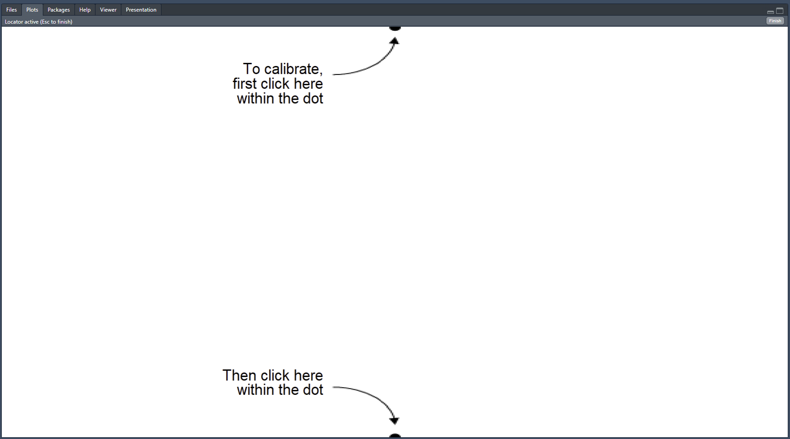
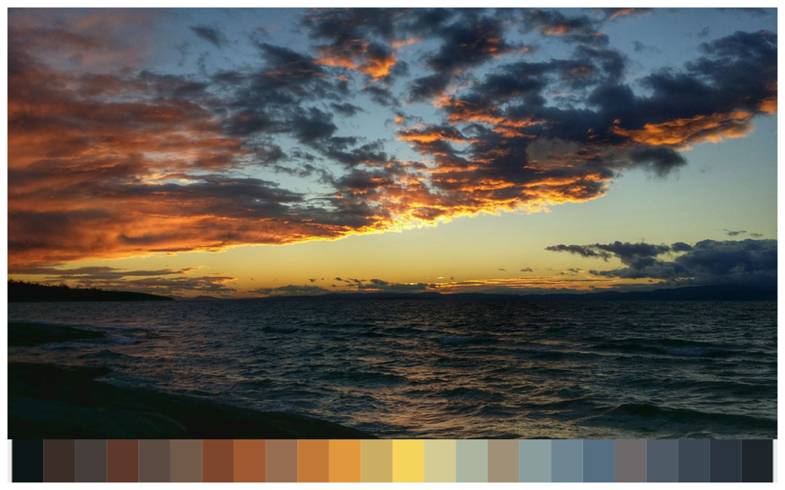
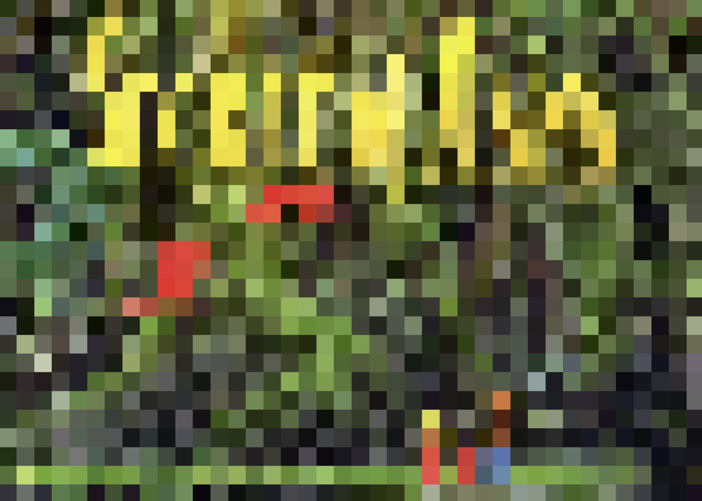
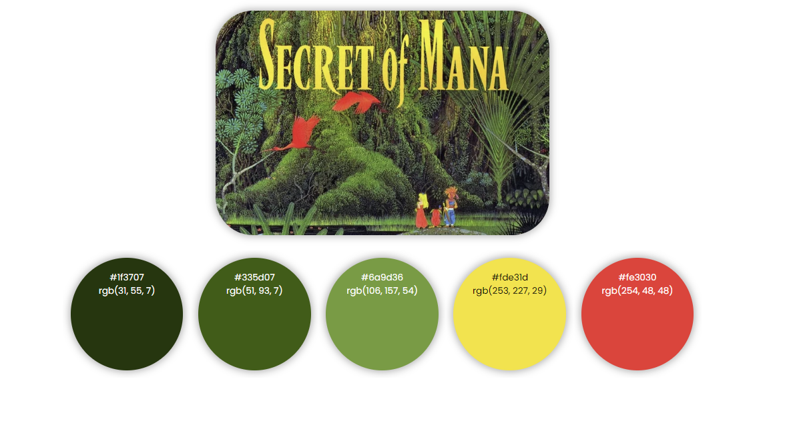
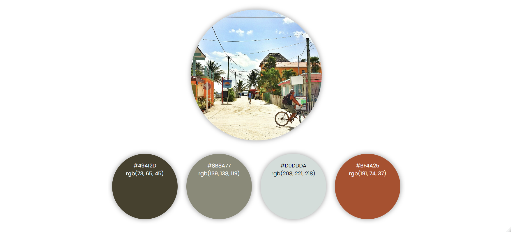
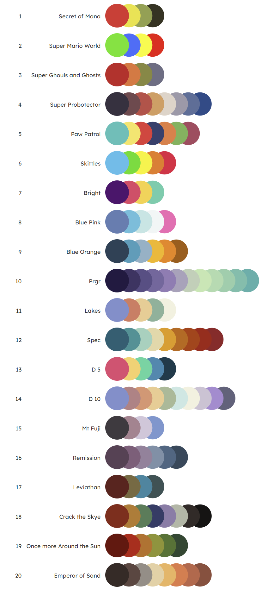

# eyedroppeR 

There are fancy ways to extract colours from images but sometimes it’s
easier if you could simply click on the image and choose the colours you
want.

With `eyedroppeR` you can click on the image and it will return the hex
codes of the selected pixel all within R.

## Installation

``` r
devtools::install_github("doehm/eyedroppeR")
```

## Usage

Use `eyedropper` with the following steps:

1.  Find the image you want to pick colours from online. Local images cn
    be used as well.

2.  Right-click and ‘copy image address’. As an example copy the
    following image (right-click \> copy image address).

    

3.  Choose how many colours to pick e.g. `n = 8`.

4.  Run
    `eyedropper(n = 8, img_path = '<paste address here>', label = "Sunset on the South Coast")`.

5.  If it’s the first time you have run `eyedropper` complete the
    calibration setup. It only needs to be done once, just click the top
    dot and then the bottom dot. (This is temporary until I find an
    automated way to do it that works for everyone’s system setup. It
    only takes a few seconds, and trust me it’s more efficient than
    selecting the wrong colours and trying to work out why.)

    

    

6.  Click the 8 desired colours. You can click on either the image
    itself or the swatch at the bottom. The image will be stretched to
    the borders of the window, but that’s OK.

7.  Done! Copy the returned string and add it to your script and start
    using `pal`.

    

The palette, image that is saved at the temporary address, and the label
will also be returned by the function. It will also output to console a
message that can be copied and pasted directly to your code. That’s the
best part!

## Use `pixelate` to easily select the right colour

By setting `pixelate = TRUE` the original image will be converted to a
low resolution so that it’s easily to select the right colour. The
default pixelation is set to 40 (pixels on the x and y). You can adjust
that higher or lower as needed.


``` r
eyedropper(n = 5, img_path = '<paste address here>', pixelate = TRUE)
```





When `pixelate` is the swatch banner at the bottom won’t be displayed
because it’s not really needed.

## Automatically extract a palette with `extract_pal`

To speed up the process and if you’re not looking for specific colours
you can run `extract_pal` to automatically select some for you.

``` r
library(eyedroppeR)

path <- "https://github.com/doehm/eyedroppeR/blob/main/dev/images/belize.jpg?raw=true"
extract_pal(12, path, label = "Caye Caulker, Belize")
```


    caye_caulker_belize <- c('#477d7c', '#4f967e', '#a1d6f5', '#cbe8f4', '#f0e4c6', '#d8c09c', '#adae46', '#a6954f', '#e14f16', '#a92613', '#cf4959', '#d78462')

    $label
    [1] "Caye Caulker, Belize"

    $pal
     [1] "#477d7c" "#4f967e" "#a1d6f5" "#cbe8f4" "#f0e4c6" "#d8c09c" "#adae46" "#a6954f" "#e14f16" "#a92613"
    [11] "#cf4959" "#d78462"

    $img_path
    [1] "C:\\Users\\Dan\\AppData\\Local\\Temp\\RtmpIN1NcN\\file70302f63b83"

<!--  -->

Often you won’t quite get what you’re after and you’ll want to use
`eyedropper` instead.

## Use `swatch()` to view a palette

``` r
path <- "https://github.com/doehm/eyedroppeR/blob/main/dev/images/belize.jpg?raw=true"
x <- extract_pal(4, path)

swatch(x$pal, path)
```



## Other functions

- `sort_pal`: Allows you to manually sort a palette by clicking on the
  colours in order. It also allows you to select a specified number of
  colours if you don’t want them all.

- `show_pencil_case`: There are a bunch of palettes stored in the
  `pencil_case`. This will plot them all so you can easily choose the
  one you want.

- `palette`: Helper to read a palette from the `pencil_case`.
  e.g. `palette(1)`

## Palettes in the `pencil_case`

``` r
show_pencil_case()
```


